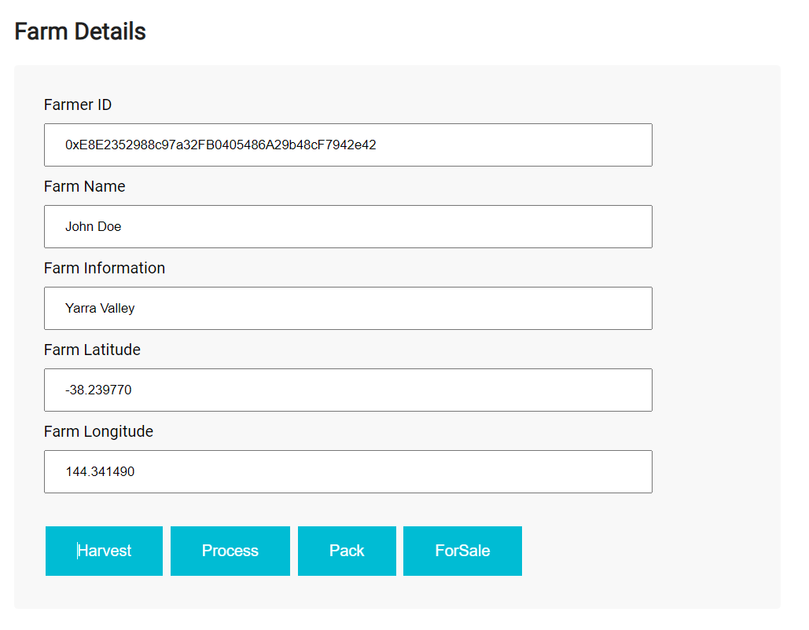
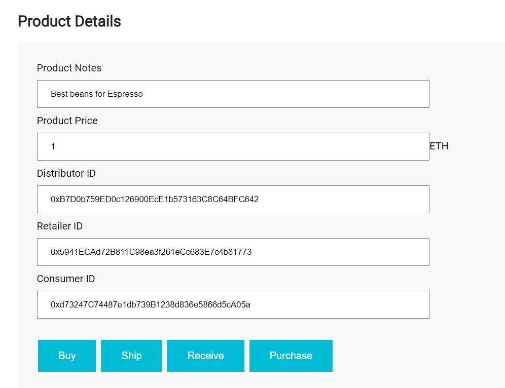
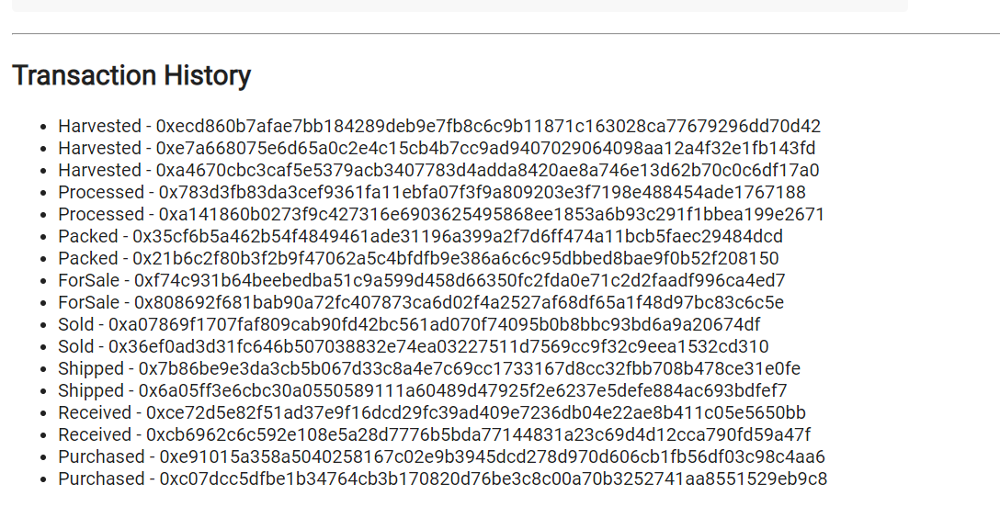

# Supply chain & data auditing

This repository containts an Ethereum DApp that demonstrates a Supply Chain flow between a Seller and Buyer. The user story is similar to any commonly used supply chain process. A Seller can add items to the inventory system stored in the blockchain. A Buyer can purchase such items from the inventory system. Additionally a Seller can mark an item as Shipped, and similarly a Buyer can mark an item as Received.

The DApp User Interface when running should look like...









## Getting Started

These instructions will get you a copy of the project up and running on your local machine for development and testing purposes. See deployment for notes on how to deploy the project on a live system.

### Prerequisites

Please make sure you've already installed ganache-cli, Truffle and enabled MetaMask extension in your browser.

```
Node version: v16.13.0
Truffle version:Truffle v5.5.21 - a development framework for Ethereum
OpenZeppelin version: 2.3.0
truffle-hdwallet-provider": 1.0.17
```

### Installing

Clone this repository:

```
git clone https://github.com/udacity/nd1309/tree/master/course-5/project-6
```

Change directory to ```project-6``` folder and install all requisite npm packages (as listed in ```package.json```):

```
cd project-6
npm install
```

Launch Ganache:

```
ganache-cli -m "spirit supply whale amount human item harsh scare congress discover talent hamster"
```

Your terminal should look something like this:

```
truffle develop
Warning: Both truffle-config.js and truffle.js were found. Using truffle-config.js.
Truffle Develop started at http://127.0.0.1:9545/

Accounts:
(0) 0xe8e2352988c97a32fb0405486a29b48cf7942e42
(1) 0xb7d0b759ed0c126900ece1b573163c8c64bfc642
(2) 0x5941ecad72b811c98ea3f261ecc683e7c4b81773
(3) 0xc871f01b78ec39c02f0ad3fe592e4ec63d912596
(4) 0xd73247c74487e1db739b1238d836e5866d5ca05a
(5) 0x31672ab3d817b2a11231f4745e941cf4ec21025f
(6) 0x0f6e13bdfa0a21d2e2205703a5de5ad55aaee157
(7) 0x990ba7f4149679b7a200d2887ff07358960ab7f7
(8) 0x445b33973a8d1931787c7c7711dea6cbc9ed58b9
(9) 0x4d545172160a896f36ba17c83f26a4d5d0ac3396

Private Keys:
(0) 22bb006bc04a7caf1043d35d8845050a4ece31d42c46aca70d426305674e3e24
(1) 2b562c316c4298d574ea8c74d87df2f070846b5c8d966f632a42b0b69974af8f
(2) 14c3ac74c391ad30ce3f096036e003a77d3a09ec8912bf71e8c6af4b5f42d48e
(3) 7db7362be50b83d030b956cddeba0fc75726117ebc42ab6db95b5d6a2a54cae7
(4) f9986e6849f978d0447d0e42bc9abf968a0f1d8c6e7ae25d101a1a0028e5da86
(5) 79b8a87fdb534cb6a24be74859457fafd9420e7b5024555341eb15f98e7ae5d5
(6) 81ae74ba8df72c57565e29b8cd1c2dee3b9bfefe204706e0d1d6351e25e56b39
(7) 8893a9afdbe84db6841659e547bf9de6696bec1ac50af05523c88ca05a6fc587
(8) 25329e485d9802f1dda005a03f6129b855e6d828a454785c2e474903fc1f4603
(9) d9f51992cec4f28be5953b063e53157ffdb94e268b526e797b13b46029cc863a

Mnemonic: lady element muffin illness frame wolf soccer shell hybrid camp rally arm

⚠️  Important ⚠️  : This mnemonic was created for you by Truffle. It is not secure.
Ensure you do not use it on production blockchains, or else you risk losing funds.

```

In a separate terminal window, Compile smart contracts:

```
truffle compile
```

Your terminal should look something like this:

```
truffle(develop)> compile

Compiling your contracts...
===========================
> Compiling .\contracts\Migrations.sol
> Compiling .\contracts\coffeeaccesscontrol\ConsumerRole.sol
> Compiling .\contracts\coffeeaccesscontrol\DistributorRole.sol
> Compiling .\contracts\coffeeaccesscontrol\FarmerRole.sol
> Compiling .\contracts\coffeeaccesscontrol\RetailerRole.sol
> Compiling .\contracts\coffeeaccesscontrol\Roles.sol
> Compiling .\contracts\coffeebase\SupplyChain.sol
> Compiling .\contracts\coffeecore\Ownable.sol
> Artifacts written to F:\Udacity BlockChain\Udacity BlockChain Projects\nd1309-Project-6b-Example-Template-master\nd1309-Project-6b-Example-Template-master\project-6\build\contracts
> Compiled successfully using:
   - solc: 0.5.16+commit.9c3226ce.Emscripten.clang

```

This will create the smart contract artifacts in folder ```build\contracts```.

Migrate smart contracts to the locally running blockchain, ganache-cli:

```
truffle migrate
```

Your terminal should look something like this:

```
truffle(develop)> migrate

Compiling your contracts...
===========================
> Compiling .\contracts\Migrations.sol
> Compiling .\contracts\coffeeaccesscontrol\ConsumerRole.sol
> Compiling .\contracts\coffeeaccesscontrol\DistributorRole.sol
> Compiling .\contracts\coffeeaccesscontrol\FarmerRole.sol
> Compiling .\contracts\coffeeaccesscontrol\RetailerRole.sol
> Compiling .\contracts\coffeeaccesscontrol\Roles.sol
> Compiling .\contracts\coffeebase\SupplyChain.sol
> Compiling .\contracts\coffeecore\Ownable.sol
> Artifacts written to F:\Udacity BlockChain\Udacity BlockChain Projects\nd1309-Project-6b-Example-Template-master\nd1309-Project-6b-Example-Template-master\project-6\build\contracts
> Compiled successfully using:
   - solc: 0.5.16+commit.9c3226ce.Emscripten.clang


Starting migrations...
======================
> Network name:    'develop'
> Network id:      5777
> Block gas limit: 6721975 (0x6691b7)


1_initial_migration.js
======================

   Replacing 'Migrations'
   ----------------------
   > transaction hash:    0xc584d7d81e93c93fd3094e964f3cf9e7c6c8610111222a3da09a139e4598af3f
   > Blocks: 0            Seconds: 0
   > contract address:    0x4b794F38488011271815E1A26F2Ead5036276308
   > block number:        1
   > block timestamp:     1658285040
   > account:             0xE8E2352988c97a32FB0405486A29b48cF7942e42
   > balance:             99.999235437625
   > gas used:            226537 (0x374e9)
   > gas price:           3.375 gwei
   > value sent:          0 ETH
   > total cost:          0.000764562375 ETH

   > Saving migration to chain.
   > Saving artifacts
   -------------------------------------
   > Total cost:      0.000764562375 ETH


2_deploy_contracts.js
=====================

   Replacing 'FarmerRole'
   ----------------------
   > transaction hash:    0x29f90e5eb8b934d1d67334d29c1fb26f72233f2ffbcebd7e560e6e1e826d9eec
   > Blocks: 0            Seconds: 0
   > contract address:    0xcd11E6dF6dEBfa522cf4CCe8594F048E5939880D
   > block number:        3
   > block timestamp:     1658285042
   > account:             0xE8E2352988c97a32FB0405486A29b48cF7942e42
   > balance:             99.998111109366386558
   > gas used:            306684 (0x4adfc)
   > gas price:           3.177688086 gwei
   > value sent:          0 ETH
   > total cost:          0.000974546092966824 ETH


   Replacing 'DistributorRole'
   ---------------------------
   > transaction hash:    0x7e69bc31f09f15a62aa46326dd3f0c3b8f552af79109a607d0b4b9a11a05b73f
   > Blocks: 0            Seconds: 0
   > contract address:    0x59cDc607cb8B9100a080ED9f474799ED00432924
   > block number:        4
   > block timestamp:     1658285043
   > account:             0xE8E2352988c97a32FB0405486A29b48cF7942e42
   > balance:             99.997010423566164421
   > gas used:            354979 (0x56aa3)
   > gas price:           3.100706803 gwei
   > value sent:          0 ETH
   > total cost:          0.001100685800222137 ETH


   Replacing 'RetailerRole'
   ------------------------
   > transaction hash:    0xedd2a72ef88b1333d32f3c197fa7e21fffd0b5e5c7d795dfedf8a69013497b78
   > Blocks: 0            Seconds: 0
   > contract address:    0x41f72349336D79d6A10991Db691067C4bbC9e5F1
   > block number:        5
   > block timestamp:     1658285045
   > account:             0xE8E2352988c97a32FB0405486A29b48cF7942e42
   > balance:             99.996068360961499813
   > gas used:            310548 (0x4bd14)
   > gas price:           3.033549096 gwei
   > value sent:          0 ETH
   > total cost:          0.000942062604664608 ETH


   Replacing 'ConsumerRole'
   ------------------------
   > transaction hash:    0xdc8b394f288e50a607ae9692fe49ff0816b768c08ca36fd7afde022f57d42a6e
   > Blocks: 0            Seconds: 0
   > contract address:    0x65c009F5F8E06EDb11b52c0C11e4C57adBAD99a5
   > block number:        6
   > block timestamp:     1658285046
   > account:             0xE8E2352988c97a32FB0405486A29b48cF7942e42
   > balance:             99.995013144777533634
   > gas used:            354931 (0x56a73)
   > gas price:           2.973017809 gwei
   > value sent:          0 ETH
   > total cost:          0.001055216183966179 ETH


   Replacing 'SupplyChain'
   -----------------------
   > transaction hash:    0x93f87954ee2053d9be00f6457fb3d19348da81654b115e57d346cbd32862aba8
   > Blocks: 0            Seconds: 0
   > contract address:    0x528c706500DC109436BE9e90D01F261FbA823805
   > block number:        7
   > block timestamp:     1658285047
   > account:             0xE8E2352988c97a32FB0405486A29b48cF7942e42
   > balance:             99.986913669620035314
   > gas used:            2773665 (0x2a52a1)
   > gas price:           2.920134608 gwei
   > value sent:          0 ETH
   > total cost:          0.00809947515749832 ETH

   > Saving migration to chain.
   > Saving artifacts
   -------------------------------------
   > Total cost:     0.012171985839318068 ETH

Summary
=======
> Total deployments:   6
> Final cost:          0.012936548214318068 ETH

```

Test smart contracts:

```
truffle test
```

All 10 tests should pass.

```
truffle(develop)> test
Using network 'develop'.


Compiling your contracts...
===========================
> Compiling .\contracts\Migrations.sol
> Compiling .\contracts\coffeeaccesscontrol\ConsumerRole.sol
> Compiling .\contracts\coffeeaccesscontrol\DistributorRole.sol
> Compiling .\contracts\coffeeaccesscontrol\FarmerRole.sol
> Compiling .\contracts\coffeeaccesscontrol\RetailerRole.sol
> Compiling .\contracts\coffeeaccesscontrol\Roles.sol
> Compiling .\contracts\coffeebase\SupplyChain.sol
> Compiling .\contracts\coffeecore\Ownable.sol
> Artifacts written to C:\Users\DELL\AppData\Local\Temp\test--10376-aEXmxrAQLDtj
> Compiled successfully using:
   - solc: 0.5.16+commit.9c3226ce.Emscripten.clang
ganache-cli accounts used here...
Contract Owner: accounts[0]  0xE8E2352988c97a32FB0405486A29b48cF7942e42
Farmer: accounts[1]  0xB7D0b759ED0c126900EcE1b573163C8C64BFC642
Distributor: accounts[2]  0x5941ECAd72B811C98ea3f261eCc683E7c4b81773
Retailer: accounts[3]  0xc871f01B78eC39c02f0aD3fE592e4Ec63D912596
Consumer: accounts[4]  0xd73247C74487e1db739B1238d836e5866d5cA05a


  Contract: SupplyChain
    ✔ Testing smart contract function harvestItem() that allows a farmer to harvest coffee (1145ms)
    ✔ Testing smart contract function processItem() that allows a farmer to process coffee (2175ms)
    ✔ Testing smart contract function packItem() that allows a farmer to pack coffee (1128ms)
    ✔ Testing smart contract function sellItem() that allows a farmer to sell coffee (1119ms)
    ✔ Testing smart contract function buyItem() that allows a distributor to buy coffee (2241ms)
    ✔ Testing smart contract function shipItem() that allows a distributor to ship coffee (1124ms)
    ✔ Testing smart contract function receiveItem() that allows a retailer to mark coffee received (2215ms)
    ✔ Testing smart contract function purchaseItem() that allows a consumer to purchase coffee (2191ms)
    ✔ Testing smart contract function fetchItemBufferOne() that allows anyone to fetch item details from blockchain (62ms)
    ✔ Testing smart contract function fetchItemBufferTwo() that allows anyone to fetch item details from blockchain (58ms)


  10 passing (14s)

```
In a separate terminal window, launch the DApp:

```
npm run dev
```

While deploying on rinkeby test network, the output should be below

```
truffle(develop)> migrate --reset --network rinkeby

Compiling your contracts...
===========================
> Compiling .\contracts\Migrations.sol
> Compiling .\contracts\coffeeaccesscontrol\ConsumerRole.sol
> Compiling .\contracts\coffeeaccesscontrol\DistributorRole.sol
> Compiling .\contracts\coffeeaccesscontrol\FarmerRole.sol
> Compiling .\contracts\coffeeaccesscontrol\RetailerRole.sol
> Compiling .\contracts\coffeeaccesscontrol\Roles.sol
> Compiling .\contracts\coffeebase\SupplyChain.sol
> Compiling .\contracts\coffeecore\Ownable.sol
> Artifacts written to F:\Udacity BlockChain\Udacity BlockChain Projects\nd1309-Project-6b-Example-Template-master\nd1309-Project-6b-Example-Template-master\project-6\build\contracts
> Compiled successfully using:
   - solc: 0.5.16+commit.9c3226ce.Emscripten.clang


Migrations dry-run (simulation)
===============================
> Network name:    'rinkeby-fork'
> Network id:      4
> Block gas limit: 30000000 (0x1c9c380)


1_initial_migration.js
======================

   Deploying 'Migrations'
   ----------------------
   > block number:        11055522
   > block timestamp:     1658292133
   > account:             0xE8E2352988c97a32FB0405486A29b48cF7942e42
   > balance:             0.490741692499173449
   > gas used:            226537 (0x374e9)
   > gas price:           10 gwei
   > value sent:          0 ETH
   > total cost:          0.00226537 ETH

   -------------------------------------
   > Total cost:          0.00226537 ETH


2_deploy_contracts.js
=====================

   Deploying 'FarmerRole'
   ----------------------
   > block number:        11055524
   > block timestamp:     1658292137
   > account:             0xE8E2352988c97a32FB0405486A29b48cF7942e42
   > balance:             0.487217222499173449
   > gas used:            306684 (0x4adfc)
   > gas price:           10 gwei
   > value sent:          0 ETH
   > total cost:          0.00306684 ETH


   Deploying 'DistributorRole'
   ---------------------------
   > block number:        11055525
   > block timestamp:     1658292140
   > account:             0xE8E2352988c97a32FB0405486A29b48cF7942e42
   > balance:             0.483667432499173449
   > gas used:            354979 (0x56aa3)
   > gas price:           10 gwei
   > value sent:          0 ETH
   > total cost:          0.00354979 ETH


   Deploying 'RetailerRole'
   ------------------------
   > block number:        11055526
   > block timestamp:     1658292142
   > account:             0xE8E2352988c97a32FB0405486A29b48cF7942e42
   > balance:             0.480561952499173449
   > gas used:            310548 (0x4bd14)
   > gas price:           10 gwei
   > value sent:          0 ETH
   > total cost:          0.00310548 ETH


   Deploying 'ConsumerRole'
   ------------------------
   > block number:        11055527
   > block timestamp:     1658292146
   > account:             0xE8E2352988c97a32FB0405486A29b48cF7942e42
   > balance:             0.477012642499173449
   > gas used:            354931 (0x56a73)
   > gas price:           10 gwei
   > value sent:          0 ETH
   > total cost:          0.00354931 ETH


   Deploying 'SupplyChain'
   -----------------------
   > block number:        11055528
   > block timestamp:     1658292153
   > account:             0xE8E2352988c97a32FB0405486A29b48cF7942e42
   > balance:             0.449275992499173449
   > gas used:            2773665 (0x2a52a1)
   > gas price:           10 gwei
   > value sent:          0 ETH
   > total cost:          0.02773665 ETH

   -------------------------------------
   > Total cost:          0.04100807 ETH

Summary
=======
> Total deployments:   6
> Final cost:          0.04327344 ETH


Starting migrations...
======================
> Network name:    'rinkeby'
> Network id:      4
> Block gas limit: 30000000 (0x1c9c380)


1_initial_migration.js
======================

   Deploying 'Migrations'
   ----------------------
   > transaction hash:    0x80341000dad2fae5dcffc90bed66acf3026b45170dbc84d8374dd8112593b225
   > Blocks: 0            Seconds: 13
   > contract address:    0x528c706500DC109436BE9e90D01F261FbA823805
   > block number:        11055529
   > block timestamp:     1658292175
   > account:             0xE8E2352988c97a32FB0405486A29b48cF7942e42
   > balance:             0.490741692499173449
   > gas used:            226537 (0x374e9)
   > gas price:           10 gwei
   > value sent:          0 ETH
   > total cost:          0.00226537 ETH

   > Saving migration to chain.
   > Saving artifacts
   -------------------------------------
   > Total cost:          0.00226537 ETH


2_deploy_contracts.js
=====================

   Deploying 'FarmerRole'
   ----------------------
   > transaction hash:    0x3f3ce6b89ff870cef3a0254a9fe95b359359f32f315df832a1f4452610736708
   > Blocks: 1            Seconds: 9
   > contract address:    0x8e0AB557324b0E2c09343e979C2387D825B9DBf6
   > block number:        11055531
   > block timestamp:     1658292205
   > account:             0xE8E2352988c97a32FB0405486A29b48cF7942e42
   > balance:             0.487217222499173449
   > gas used:            306684 (0x4adfc)
   > gas price:           10 gwei
   > value sent:          0 ETH
   > total cost:          0.00306684 ETH


   Deploying 'DistributorRole'
   ---------------------------
   > transaction hash:    0xade085249e379b4d388179b480f0c975b0dea5639ece5d9bd9e56570ddc5ea5e
   > Blocks: 2            Seconds: 21
   > contract address:    0x3D658eED48Eaa23f4dB86Bfd4060a85c4CE8C53E
   > block number:        11055533
   > block timestamp:     1658292235
   > account:             0xE8E2352988c97a32FB0405486A29b48cF7942e42
   > balance:             0.483667432499173449
   > gas used:            354979 (0x56aa3)
   > gas price:           10 gwei
   > value sent:          0 ETH
   > total cost:          0.00354979 ETH


   Deploying 'RetailerRole'
   ------------------------
   > transaction hash:    0xce9ce3c653ceb871ffa7f82bffc1bd8e97fd4c98e77289c6a7e54cf4713972d3
   > Blocks: 2            Seconds: 21
   > contract address:    0xfBb479aCd53D646a0448a51bA9D05BBD2F68bDc4
   > block number:        11055535
   > block timestamp:     1658292265
   > account:             0xE8E2352988c97a32FB0405486A29b48cF7942e42
   > balance:             0.480561952499173449
   > gas used:            310548 (0x4bd14)
   > gas price:           10 gwei
   > value sent:          0 ETH
   > total cost:          0.00310548 ETH


   Deploying 'ConsumerRole'
   ------------------------
   > transaction hash:    0x3a7657fdc74188cc234a29168f7555db3d59c26c3c8abf3738dd0380d0c53ccc
   > Blocks: 0            Seconds: 5
   > contract address:    0x38eadEc6dd3925E242a2B1527846dd0ebf09bF23
   > block number:        11055536
   > block timestamp:     1658292280
   > account:             0xE8E2352988c97a32FB0405486A29b48cF7942e42
   > balance:             0.477012642499173449
   > gas used:            354931 (0x56a73)
   > gas price:           10 gwei
   > value sent:          0 ETH
   > total cost:          0.00354931 ETH


   Deploying 'SupplyChain'
   -----------------------
   > transaction hash:    0xd4310efa0c8a1505a94605fa85e2de8069d646c7beaefa8698e5db30b052f5be
   > Blocks: 1            Seconds: 9
   > contract address:    0xA5CA78D5305aBe2ce3CEB749EF087932fb310340
   > block number:        11055537
   > block timestamp:     1658292295
   > account:             0xE8E2352988c97a32FB0405486A29b48cF7942e42
   > balance:             0.449275992499173449
   > gas used:            2773665 (0x2a52a1)
   > gas price:           10 gwei
   > value sent:          0 ETH
   > total cost:          0.02773665 ETH

   > Saving migration to chain.
   > Saving artifacts
   -------------------------------------
   > Total cost:          0.04100807 ETH

Summary
=======
> Total deployments:   12
> Final cost:          0.08654688 ETH

```

Contract Address: 0x528c706500DC109436BE9e90D01F261FbA823805

## Built With

* [Ethereum](https://www.ethereum.org/) - Ethereum is a decentralized platform that runs smart contracts
* [Truffle Framework](http://truffleframework.com/) - Truffle is the most popular development framework for Ethereum with a mission to make your life a whole lot easier.


## Acknowledgments

* Solidity
* Ganache-cli
* Truffle
* IPFS
